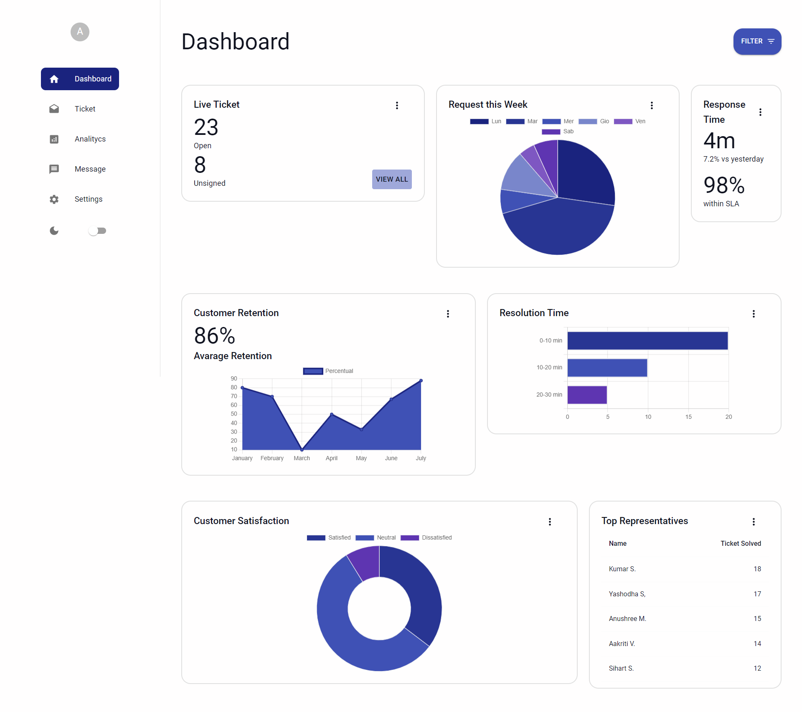
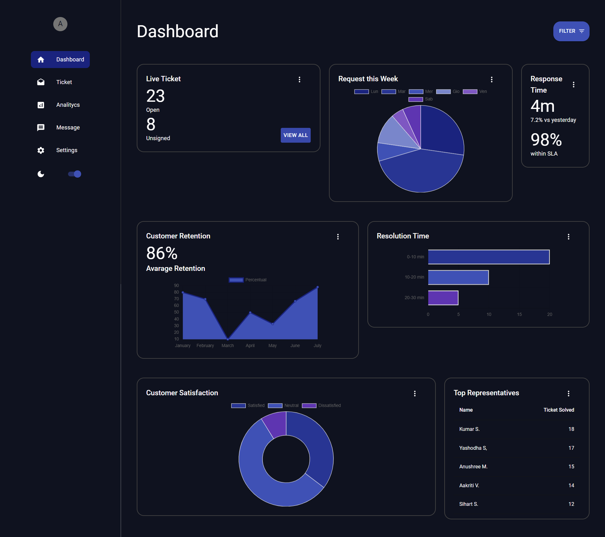
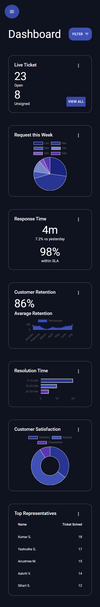

<h1>REACT MATERIAL UI DASHBOARD</h1>

Dashboard realizzata con la libreria Material UI e ChartJs.

<h3>Screen dashboard:</h3>
<ul>
    <li>
        <h5>Light Mode:</h5>
        
    </li>
    <li>
        <h5>Dark Mode:</h5>
        
    </li>
    <li>
        <h5>Mobile:</h5>
        
    </li>
</ul>

